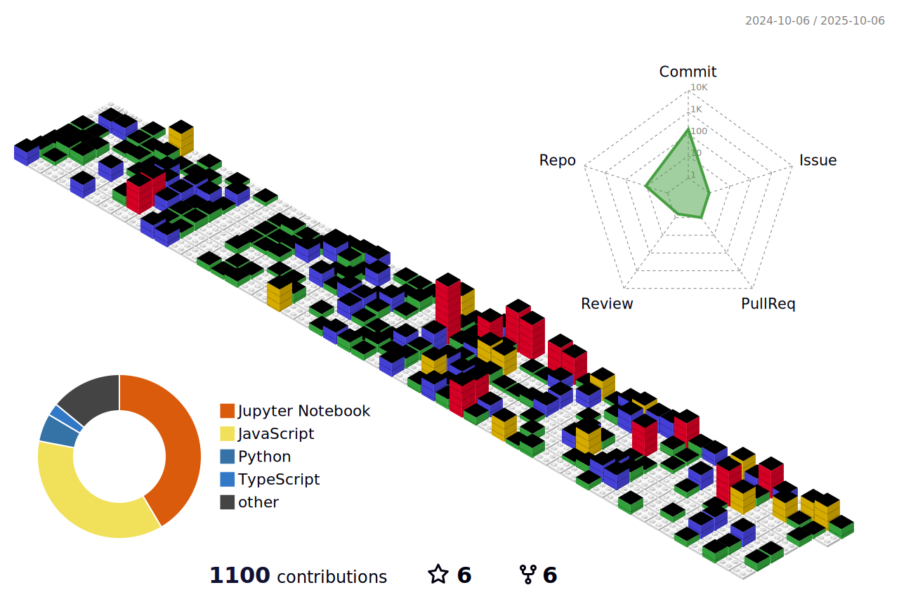

<h1 align="center">Hi 👋, I'm Candido</h1>
<h2 align="center">Computer Scientist 🧑‍💻</h2>

  

  

- 🔭 I’m currently working on [IFCE](https://ifce.edu.br)
- 📫 How to reach me [antoniolmcandido.com](https://antoniolmcandido.com)

 

  

  

<h2>🛠 Languages and Tools:</h2>

  

<h2>📊 Github Stats: <h2/>

  

  

  

  

<picture>
  <source media="(prefers-color-scheme: dark)" srcset="https://raw.githubusercontent.com/antoniolmcandido/antoniolmcandido/output/pacman-contribution-graph-dark.svg">
  <source media="(prefers-color-scheme: light)" srcset="https://raw.githubusercontent.com/antoniolmcandido/antoniolmcandido/output/pacman-contribution-graph.svg">
  
</picture>

  

